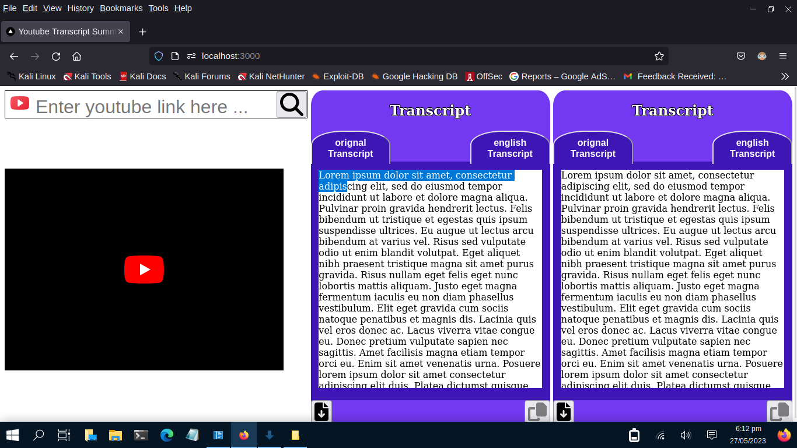

This is a [Next.js](https://nextjs.org/) project bootstrapped with [`create-next-app`](https://github.com/vercel/next.js/tree/canary/packages/create-next-app).

## Demo 
[](https://dms.licdn.com/playlist/vid/D4D05AQHxkIBE59FjqA/mp4-640p-30fp-crf28/0/1685256305615?e=1687093200&v=beta&t=yVi92PNbibUOB-eg3B7RSpe42BE8SqcBgvCzrWk0Wzk)

## Getting Started

First, run the development server:

```bash
npm install
npm run dev
```
Node.js backend 
```bash
npm install
npm start
```
Summarizer backend
```bash
pip install googletrans==4.0.0-rc1 
pip install flask flask_cors googletrans spacy           
python3 -m spacy download en_core_web_sm
python3 transcriptSummaryAPI.py
```

Open [http://localhost:3000](http://localhost:3000) with your browser to see the result.

## Data in which language youtube videos approximately are
|S.No|Language|% approx usage|
|----|-------|------|
|1	|English|	52%|
|2	|Spanish|	11%|
|3	|Portuguese|	8%|
|4	|Russian|	4%|
|5	|German|	3%|
|6	|Japanese|	3%|
|7	|French|	3%|
|8	|Korean|	2%|
|9	|Hindi|	2%|
|10	|Italian|	2%| 

## Youtube Videos links 
```ruby
Hindi-https://www.youtube.com/watch?v=hr7XNl6UqLw
English-https://www.youtube.com/watch?v=1j0X9QMF--M
Japanese-https://www.youtube.com/watch?v=_p1hJg0D5QE
French- https://www.youtube.com/watch?v=NiKtZgImdlY
Spanish - https://www.youtube.com/watch?v=xbX3NOiRX_w
```

## Problem Solved
```bash
The problem is there are many methods to summarize text in english. It is difficult to find summarizer in any language of the world. So i thought of a solution by converting given language transcript  to english transcript then summarize it, finally converting transcript in the given language.
```